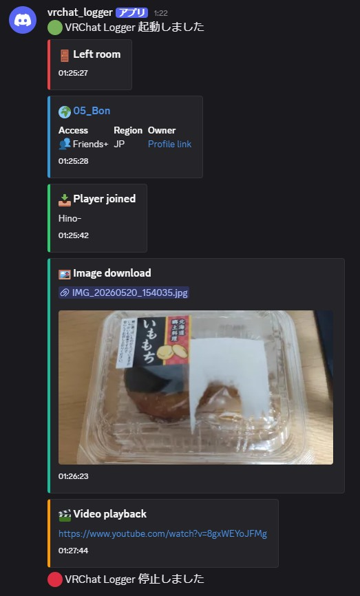

# VRChat Discord Logger

VRChatのログファイルをリアルタイムに監視し、VRChatでの活動をDiscordに通知するツール。



## 特徴

- **全インスタンスタイプ対応**: Public / Friends / Friends+ / Invite / Invite+ / Group / Group+ / Group Public
- **設定可能**: イベントごとのON/OFF、Public, Group Publicインスタンスでのミュート

## 通知されるイベント

| イベント | Embed | 説明 |
|---|---|---|
| インスタンス移動 | 🌍 ワールド名 | Access / Region / Owner or Group リンク付き |
| プレイヤーJoin | 📥 Player joined | ユーザー名 |
| プレイヤーLeave | 📤 Player left | ユーザー名 |
| メディアパッドの画像 | 🖼️ Image download | URL, プレビュー |
| 動画再生 | 🎬 Video playback | URL |
| VRChat終了 | ⏻ VRChat Shutdown |

## セットアップ

### 1. 必要なもの

- Python 3.10+
- Discord Webhook URL（[作成方法](https://support.discord.com/hc/ja/articles/228383668-%E3%82%A6%E3%82%A7%E3%83%96%E3%83%95%E3%83%83%E3%82%AF%E3%81%AE%E3%81%94%E7%B4%B9%E4%BB%8B)）

### 2. インストール

```bash
git clone https://github.com/Hino-VRChat/vrchat-discord-logger.git
cd vrchat-discord-logger
pip install -r requirements.txt
```

### 3. 設定

`config.json` を編集:

```json
{
    "discord_webhook_url": "YOUR_DISCORD_WEBHOOK_URL",
    "vrchat_log_dir": ""
}
```

- `discord_webhook_url`: Discord Webhook URL（必須）
- `vrchat_log_dir`: VRChatのログディレクトリ。空欄の場合は `%APPDATA%` から自動検出

### 4. 実行

```bash
python main.py
```

起動すると Discord に `🟢 VRChat Logger 起動しました` と通知されます。
`Ctrl+C` で停止（`🔴 VRChat Logger 停止しました` が通知されます）。

## 設定項目

```json
{
    "discord_webhook_url": "",
    "vrchat_log_dir": "",
    "poll_interval_sec": 1.0,
    "rotation_check_interval_sec": 30,
    "events": {
        "player_joined": true,
        "player_left": true,
        "image_download": true,
        "video_playback": true
    },
    "filter": {
        "mute_join_leave_in_public": true
    },
    "embed_colors": {
        "entering_room": 3447003,
        "player_joined": 3066993,
        "player_left": 15158332,
        "image": 1752220,
        "video": 16750848,
        "shutdown": 15548997
    }
}
```

| 項目 | 説明 | デフォルト |
|---|---|---|
| `poll_interval_sec` | ログファイルの読み取り間隔（秒） | 1.0 |
| `rotation_check_interval_sec` | ログローテーション確認間隔（秒） | 30 |
| `events.*` | 各イベントの通知ON/OFF | すべて true |
| `filter.mute_join_leave_in_public` | Public/GroupPublic インスタンスで Join/Leave/Video/Image をミュート | true |

## License

MIT License
